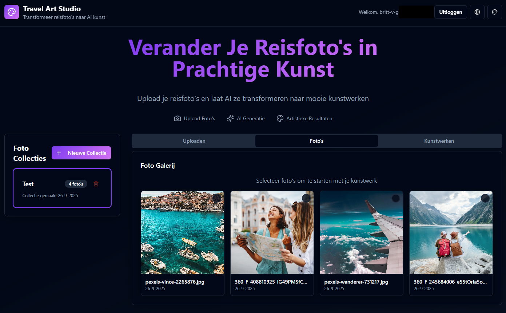
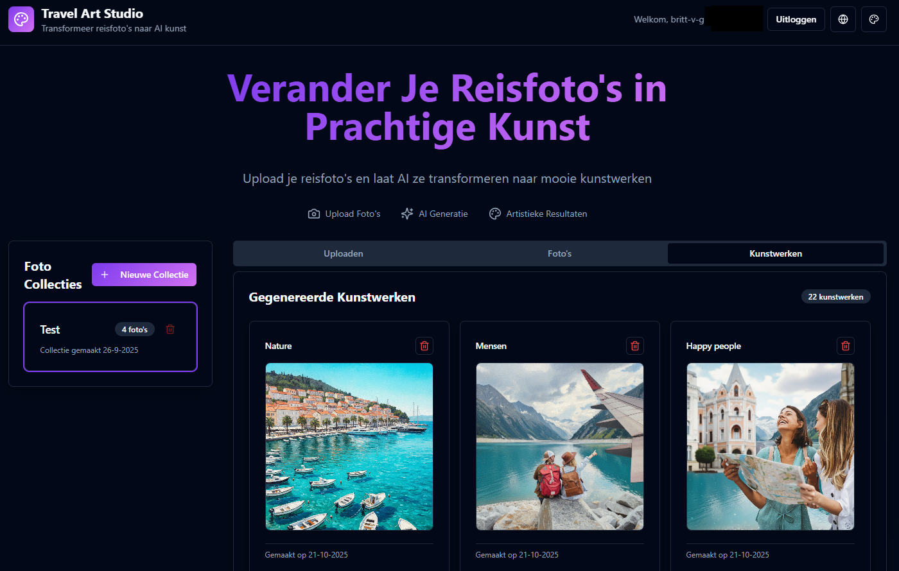

# Travel Art Forge (Work in Progress)

## Project info
An application to create AI art from your travel photos. The goal of this project is to experiment with Lovable.dev, AI models, Ollama (replaced with Gemini) and Supabase. Because of hardware restrictions, free cloud models are used for the AI art. This might result in request limitations or bad results.
**URL**: https://travel-art.vercel.app/
s
## Screenshots



## Setup

```sh
# Install Node.js dependencies
npm install

# Start the frontend development server
npm run dev
```

```sh
# Create and activate a virtual environment
cd api
python -m venv venv
source venv/bin/activate  # On Linux/Mac
# or: venv\Scripts\activate  # On Windows

# Install Python dependencies
pip install -r requirements.txt

# Start the FastAPI server
uvicorn main:app --reload --port 8000
```

```sh
# Local functions testing with Docker:
npx supabase start
npx supabase login
npx supabase functions serve

# Deploy to SB cloud (bijv. 'generate-artwork' function):
npx supabase functions deploy generate-artwork
```

If using local Ollama (not used right now)
```sh
ollama serve

# If not already present:
ollama pull tinyllama
```

## What technologies are used for this project?

This project is built with:
- Vite
- TypeScript
- React
- shadcn-ui
- Tailwind CSS
- Vercel
